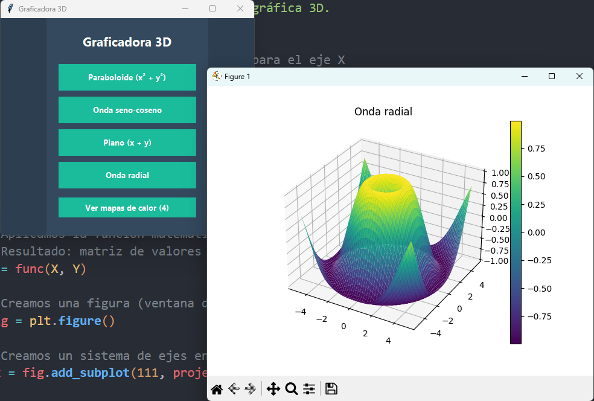
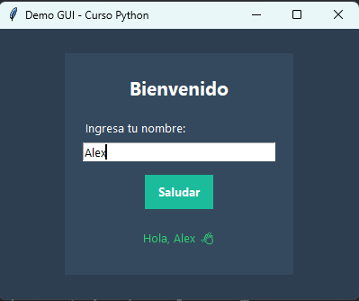
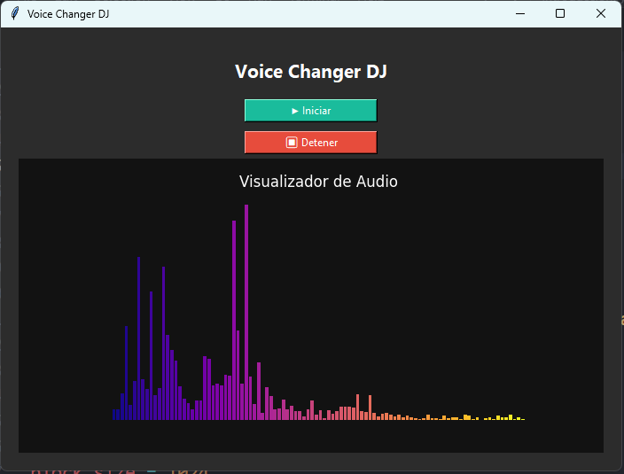

# 📘 Ejemplos de Sesión 6

Este directorio contiene los ejemplos vistos durante la sesión 6.

---

##  🚀  Cómo ejecutar los ejemplos

0. Verifica que tienes instalado python (Se recomienda la versión 3.13.3):  
```bash
python --version
```

1. Clona el repositorio:  
```bash
git clone https://github.com/AbimaelFranco/IntroduccionPython1S2026
```

2. Accede al directorio del ejemplo que quieres ejecutar:

```bash
cd .\examples\Sesion6\
```

3. Instala las librerías necesarias:

```bash
pip install pip install opencv-python mediapipe numpy matplotlib sounddevice
```

4. Ejecuta el script con Python

---

## 📚 Ejemplos

### 👁️ [Computer_Vision](./Computer_Vision)

```bash
python .\Computer_Vision\computer_vision.py
```

<p align="center">
  
  
</p> 

- Rastreo de mano
- Seguimiento de puntos de referencia
- Utilización de OpenCV y Mediapipe

### 🌐 [Pagina_Web](./Pagina_Web)

```bash
python .\Pagina_Web\apps.py
```

<p align="center">
  
</p> 

- Generación de servidor web
- Utilización de Flask
- Renderización de HTML con CSS y JS
- Recopilación de información

### 🎲 [Dados_game](./dados_game.py)

```bash
python .\dados_game.py
```

<p align="center">
  
</p> 

- Minijuego con interfaz grafica
- Uso de librerías estándar

### 🖩 [graph_calculator](./graph_calculator.py)

```bash
python .\graph_calculator.py
```

<p align="center">
  
</p> 

- Ploteo 3D
- Cálculo multivariable
- Interfaz gráfica

### 📊 [gui_example](./gui_example.py)

```bash
python .\gui_example.py
```

<p align="center">
  
</p> 

- Generación de interfaz básica sencilla

### 🗣️ [voice_filter](./voice_filter.py)

```bash
python .\voice_filter.py
```

<p align="center">
  
</p> 

- Modificación de voz
- Librerías externas
- Modulación de frecuencias
- Ploteo de espectro de frecuencias